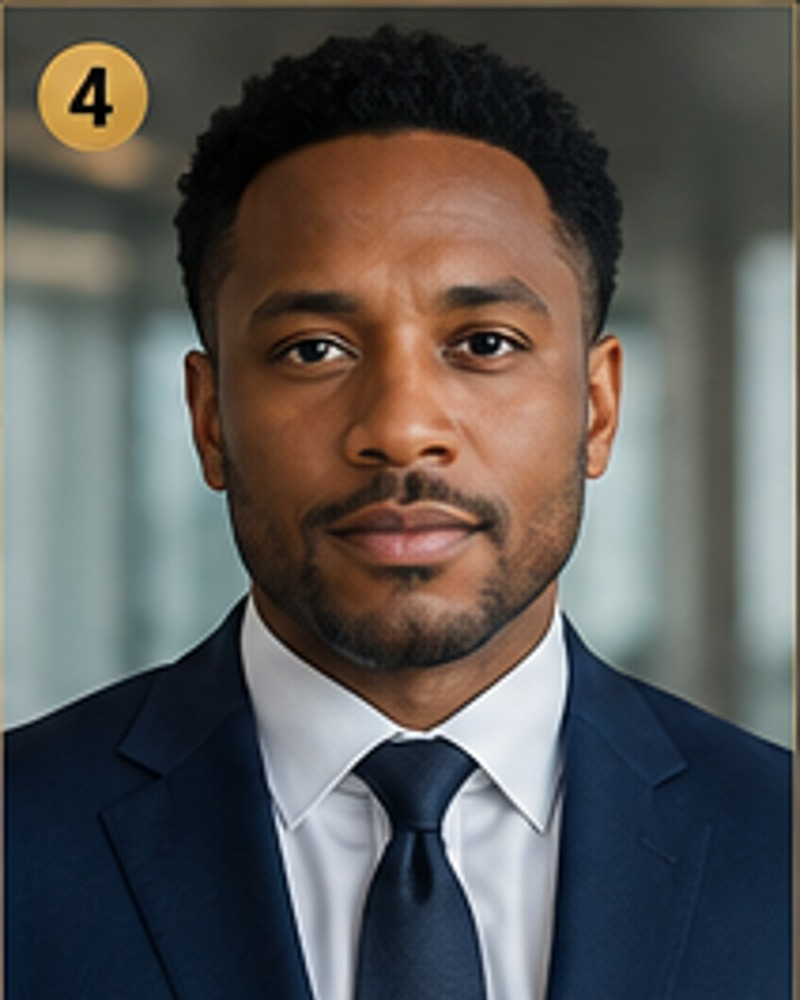

# Adrian Cross

**Cabinet:** Client Success Cabinet  
**Title:** Chief Client Officer / Director of Client Success  
**Function:** Retention, onboarding, escalation, client relationship management  
**Experience:** 13+ years  
**Office:** Client Success Office  

## Executive Profile

Adrian Cross serves as Chief Client Officer / Director of Client Success within the Client Success Cabinet. This executive role is responsible for retention, onboarding, escalation, client relationship management in support of a structured 13-cabinet company model.

Authorized to coordinate client success priorities, prepare executive reports, maintain cabinet operating standards, and support company-wide execution subject to founder, board, member, or ownership approval.

## Core Skills
- Client onboarding
- Retention systems
- Escalation management
- Account health reporting
- Service recovery
- Renewal support
- Client communication standards
- Relationship management

## Professional Experience

### Chief Client Officer
**Managed Services Organization**

Oversaw client onboarding, retention reviews, escalation handling, and account health reporting.

### Director of Client Success
**Staffing Operations Group**

Built renewal support procedures and reduced client churn through structured account management.

### Client Relationship Manager
**Commercial Services Company**

Managed portfolio communication, service recovery, satisfaction surveys, and executive client updates.

## Education & Development
- B.S. Service Management and Organizational Communication
- Professional development in client success, retention, and escalation systems

---
Demonstrative executive persona only. Do not submit as a real officer or employee record unless verified and legally appointed.
