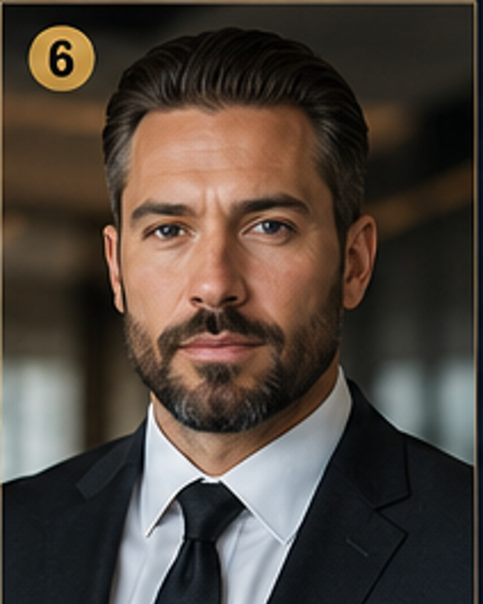

# Julian Mercer

**Cabinet:** Legal & Compliance Cabinet  
**Title:** Compliance Operations Director / Corporate Risk Coordinator  
**Function:** Contracts, risk routing, compliance workflows, document control  
**Experience:** 15+ years  
**Office:** Corporate Risk Office  

## Executive Profile

Julian Mercer serves as Compliance Operations Director / Corporate Risk Coordinator within the Legal & Compliance Cabinet. This executive role is responsible for contracts, risk routing, compliance workflows, document control in support of a structured 13-cabinet company model.

Authorized to coordinate legal & compliance priorities, prepare executive reports, maintain cabinet operating standards, and support company-wide execution subject to founder, board, member, or ownership approval.

## Core Skills
- Compliance workflows
- Contract routing
- Risk registers
- Policy documentation
- Licensing coordination
- Insurance file control
- Legal escalation
- Vendor compliance

## Professional Experience

### Compliance Operations Director
**Contract Services Organization**

Coordinated contract review workflows, vendor compliance files, policy records, and operational risk logs.

### Corporate Risk Coordinator
**Workforce Solutions Company**

Managed documentation around insurance, onboarding compliance, licensing reminders, and legal escalation.

### Policy & Records Administrator
**Business Services Office**

Maintained document retention standards, internal policy files, and compliance checklists.

## Education & Development
- B.A. Legal Studies and Business Administration
- Compliance operations training in risk documentation and contract workflows

---
Demonstrative executive persona only. Do not submit as a real officer or employee record unless verified and legally appointed.
